# SkillBridge

**Data & AI provider** pour le dataspace éducation & compétences — écosystème
[Prometheus-X](https://prometheus-x.org/) / DASES.

> À partir de traces d'apprentissage normalisées en **xAPI**, SkillBridge construit un
> **profil de maîtrise** par apprenant, segmente la population en **profils pédagogiques**
> par clustering non supervisé, et émet des **recommandations explicables** — le tout
> exposé via une **API HTTP** et démontré par une vitrine **Streamlit**.

## Fil rouge

```mermaid
flowchart LR
    A["App éducative<br/>(persona Léa)"]:::ext
    L["LRC<br/>Prometheus-X"]:::ext
    P["PLRS<br/>coffre apprenant"]:::sim
    D["PDC<br/>échange consenti"]:::sim
    S["SkillBridge<br/>provider"]:::own
    R["Recommandations<br/>explicables"]:::own

    A -->|événements bruts| L
    L -->|xAPI DASES| P
    P -->|trace consentie| D
    D -->|trace| S
    S -->|profil + cluster + recos| R

    classDef ext fill:#fff3e0,stroke:#e65100,stroke-width:1px
    classDef sim fill:#f5f5f5,stroke:#999,stroke-width:1px,stroke-dasharray: 4 2
    classDef own fill:#e0f2f1,stroke:#00897b,stroke-width:1.5px
```



| Légende | Sens |
| --- | --- |
| <span style="color:#e65100">**Orange**</span> | Brique externe réelle utilisée |
| <span style="color:#999">**Gris pointillé**</span> | Simulé au niveau 1 (réel au Lot 4 pour le PDC) |
| <span style="color:#00897b">**Teal**</span> | Code SkillBridge (ce repo) |

## Périmètre démontré (commits visibles)

- **Lot 1** — génération d'un dataset xAPI synthétique scénario maths primaire, archétypes
  spécialisés, enrichissement par compétences ([ADR 001](tech/adrs/001-referentiel-maison-et-mapping-esco.md),
  [ADR 002](tech/adrs/002-archetypes-par-forme.md), [ADR 007](tech/adrs/007-mastered-vs-attempted.md))
- **Lot 2** — profilage, clustering KMeans + silhouette empirique (k=4, silhouette 0.309),
  recommandations explicables avec sentence-transformers
  ([ADR 003](tech/adrs/003-k-par-silhouette-empirique.md))
- **Lot 3** — interopérabilité via le LRC réel (`/convert_custom`), mapping YAML maison
  CSV → xAPI ([ADR 004](tech/adrs/004-lrc-runbook-vs-submodule.md),
  [ADR 005](tech/adrs/005-profil-dases-null.md),
  [ADR 006](tech/adrs/006-csv-custom-vs-mappers-natifs.md))
- **Lot 5a/b** — API FastAPI (OpenAPI 3 sur `/docs`) + vitrine Streamlit consommant l'API
- **Lot 4** (à venir) — déploiement du PDC réel
- **Lot 5d** (à venir) — déploiement Coolify / Hetzner

## Pour démarrer

```bash
git clone https://github.com/sodigitaljeremy/skill-bridge.git
cd skill-bridge
make sync        # uv sync --extra dev
make dataset     # génère data/generated/
make demo        # API + Streamlit (http://localhost:8501)
```

Plus de détails : [tutoriel de prise en main](user/tutorial/getting-started.md).

## Honnêteté de la démo

Cette démo expose ses limites assumées plutôt que les masquer :

- Le **profil DASES** retourné par le LRC est `null` — aucun template ne couvre nos verbes
  `passed`/`failed` sur exercices ([ADR 005](tech/adrs/005-profil-dases-null.md)).
- 95 % du dataset est généré **directement** en xAPI ; seul un échantillon est réellement
  passé par le LRC pour la démo (reproductibilité vs démonstration d'interop).
- La projection 2D PCA n'explique que ~57 % de la variance — la séparation se joue sur
  les 12 dimensions ; la heatmap des centroïdes est plus informative.
- Le **PLRS** et le **PDC** sont simulés au niveau 1 (PDC réel = Lot 4).

## Liens

- [API live](http://localhost:8000/docs) (Swagger interactif, quand `make api` tourne)
- [Repo GitHub](https://github.com/sodigitaljeremy/skill-bridge)
- [Cadrage v0 — intention complète](cadrage-dases-provider-v0.md)
