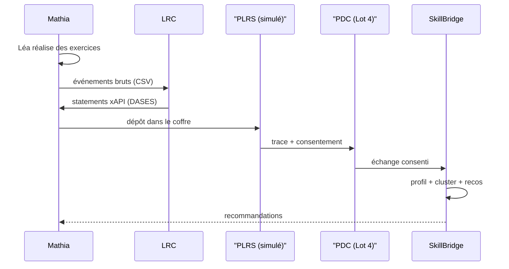

# 02 — Contexte

## Contexte métier — DASES et Prometheus-X

Les traces d'apprentissage (xAPI, SCORM, IMS Caliper, cmi5, formats propriétaires)
sont aujourd'hui **cloisonnées par organisation** et **éparpillées par format**.
Prometheus-X construit un **dataspace décentralisé et human-centric** (sous Gaia-X,
conforme RGPD / AI Act) où la donnée circule de façon souveraine et consentie.

Le **DASES** (Data Space for Education & Skills) cible quatre finalités :

1. **Portabilité** des données d'apprentissage entre fournisseurs.
2. **Personnalisation** des parcours par recommandation.
3. **Analytics de compétences** au niveau population.
4. **Entraînement d'IA** sur données mutualisées.

SkillBridge se positionne sur les finalités 1, 2 et 3 — au rôle de
**Data & AI provider**.

## Persona — Léa

> **Léa Martin**, élève de CM1 (grade 4), utilise une application de mathématiques
> façon Mathia. Elle est forte en calcul mais a des difficultés persistantes en
> géométrie — c'est l'archétype `calc_specialist` du dataset (voir
> [ADR 002](adrs/002-archetypes-par-forme.md)).

Le scénario fil rouge couvre :

## Contexte technique — l'écosystème externe

| Brique | Rôle | Statut dans cette démo |
| --- | --- | --- |
| `learning-records-converter` (LRC) | Normalisation des formats vers xAPI / DASES | **Réel** (service externe HTTP, SHA pinné — [ADR 004](adrs/004-lrc-runbook-vs-submodule.md)) |
| `dataspace-connector` (PDC) | Échange souverain de données | Simulé Lot 1, **réel au Lot 4** |
| PLRS — coffre apprenant | Stockage personnel et consentement | Simulé (stockage simple) |
| ESCO | Référentiel européen pivot des compétences | Utilisé en **cible** de mapping ([ADR 001](adrs/001-referentiel-maison-et-mapping-esco.md)) |
| Profils DASES (`lms`, `assessment`, `forum`) | Templates xAPI sémantiques | Chargés à la demande par le LRC, **pas alignés** ici ([ADR 005](adrs/005-profil-dases-null.md)) |

## Hors-périmètre

- Pas de **base de données** : les artefacts JSONL générés sont la source de vérité.
- Pas d'**authentification** sur l'API : c'est une démo lecture seule.
- Pas de **collecte temps réel** : le dataset est synthétique et reproductible (seed).
- Le **forum** profile DASES n'est pas utilisé (pas de scénario social ici).
