# 03 — Stratégie de solution

## Méthode — BMAD ("cadrage avant code")

Toute décision structurante passe par : **proposer → faire valider → implémenter →
présenter pour validation**. Pas de code spéculatif. La trace écrite de chaque décision
non triviale prend la forme d'un **ADR** (voir [Décisions](adrs/index.md)).

## Niveaux d'ambition

Le périmètre est cadré dans le [document v0](../cadrage-dases-provider-v0.md), §5. En
synthèse :

| Brique | Niveau 1 (garanti) | Niveau 2 (visé) | Niveau 3 (hors scope) |
| --- | --- | --- | --- |
| LRC | Déployé + utilisé en réel ✅ | idem | idem |
| Service IA SkillBridge | Profilage + cluster + reco ✅ | Affiné | idem |
| PDC | Échange **simulé** ✅ | Échange réel | Catalogue + Contract + Consent complet |
| PLRS | Stockage simple ✅ | Enrichi | Intégration Cozy Cloud |
| Front | Streamlit ✅ | Soigné ✅ | — |

Tous les check verts sont déjà commités. **Le PDC réel est le périmètre du Lot 4**, le
déploiement Coolify celui du Lot 5d.

## Découpage par lots

```mermaid
flowchart LR
    L0["Lot 0<br/>Spike de faisabilité"]:::done
    L1["Lot 1<br/>Dataset + archétypes"]:::done
    L2["Lot 2<br/>IA — profiling, clustering, reco"]:::done
    L3["Lot 3<br/>Interop LRC"]:::done
    L5a["Lot 5a<br/>API FastAPI"]:::done
    L5b["Lot 5b<br/>Vitrine Streamlit"]:::done
    L5c["Lot 5c<br/>Doc MkDocs"]:::done
    L4["Lot 4<br/>PDC réel"]:::todo
    L5d["Lot 5d<br/>Déploiement"]:::todo

    L0 --> L1 --> L2 --> L3 --> L5a --> L5b --> L5c
    L5c --> L4 --> L5d

    classDef done fill:#e0f2f1,stroke:#00897b
    classDef todo fill:#f5f5f5,stroke:#999,stroke-dasharray: 4 2
```

Chaque lot fait l'objet d'un commit (ou d'une série courte de commits cohérents) avec
le préfixe correspondant (`feat(lot1):`, `feat(lot2):`, etc.).

## Stratégie technique — choix structurants

### Architecture hexagonale légère

- `domain/` : entités, value objects, ports — aucun import framework.
- `application/` : cas d'usage qui orchestrent le domain via les ports.
- `adapters/inbound/` : API FastAPI, vitrine Streamlit, scripts CLI.
- `adapters/outbound/` : repositories de fichiers, encoder xAPI, encoder CSV, client
  HTTP LRC, provider sentence-transformers, stubs pour tests.

Règle interne : **pas de port sans 2ᵉ implémentation prévisible**. Au final on a 4
ports justifiés : `SkillRepository`, `LearningResourceRepository`, `TraceEncoder`,
`TraceConverter`, `EmbeddingProvider` — chacun avec au moins un stub déterministe côté
tests + une impl réelle côté prod.

### Reproductibilité par défaut

Seed unique (`42`) pour numpy + Faker → mêmes apprenants, mêmes traces, mêmes UUIDs
(via `uuid5` namespace), mêmes clusters, mêmes recos. L'API précharge tout au démarrage
avec exactement la même seed et la même bande `k ∈ [2, 8]` que la démo CLI, garantissant
que **les deux affichages ne divergent jamais**.

### Cohérence cluster / reco / API

Le clustering produit une affectation stable. La reco lit `mastered_resource_ids` du
profil (≥ 1 succès) plutôt qu'`attempted` pour autoriser le re-travail des échecs
([ADR 007](adrs/007-mastered-vs-attempted.md)). L'API précompute le top-10 reco par
apprenant au boot — les requêtes ne touchent ni KMeans ni le modèle ST.

### Honnêteté algorithmique

- `k` est l'**argmax pur** de silhouette sur k ∈ [2, 8] — pas de tie-break heuristique
  ([ADR 003](adrs/003-k-par-silhouette-empirique.md)).
- Le profil DASES est **null** si nos statements ne matchent aucun template
  ([ADR 005](adrs/005-profil-dases-null.md)).
- Le `result.success` du LRC est **non porté** dans le mapping YAML à cause d'un bug
  connu à ce SHA ([ADR 006](adrs/006-csv-custom-vs-mappers-natifs.md)).

## Déploiement souverain

Cible : **Docker / Docker Compose**, orchestré par **Coolify** sur **VPS Hetzner**.
Détails dans la [vue de déploiement](07-deployment.md).
