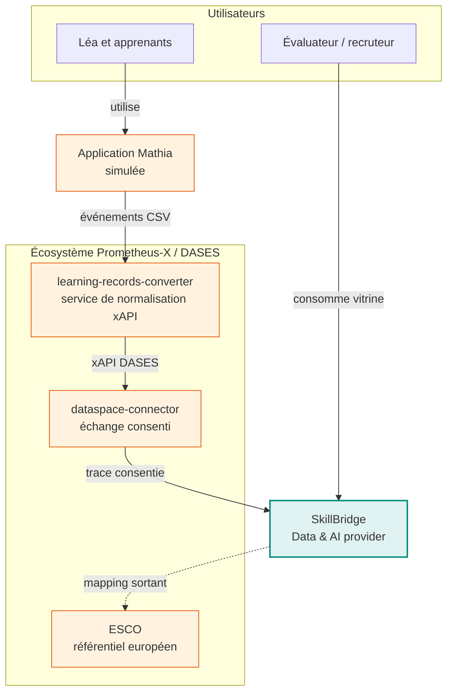
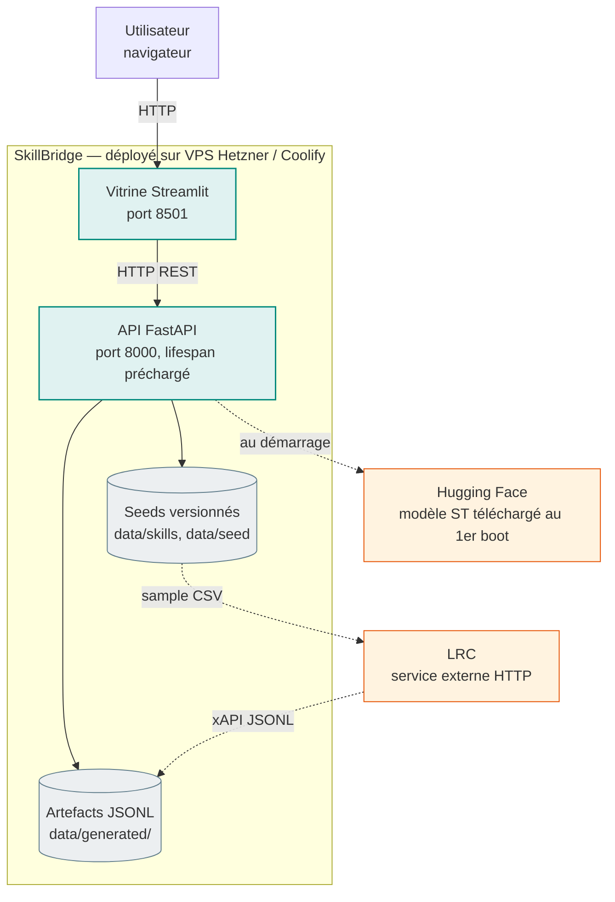
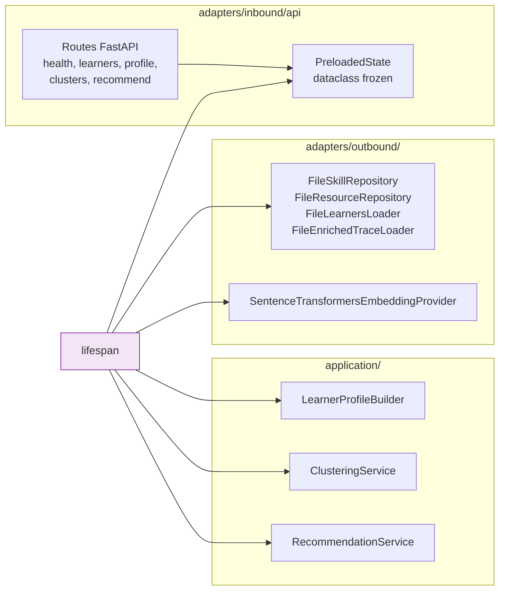

# 04 — Vue des blocs (C4)

## Niveau 1 — Contexte système



## Niveau 2 — Containers



### Lecture

- **Vitrine Streamlit** : seul l'utilisateur la voit. Elle consomme l'API en HTTP, plus
  une lecture locale de `learners.jsonl` pour la **validation cluster ↔ archétype**
  (étiquetée "vérité-terrain de simulation, indisponible en production réelle").
- **API FastAPI** : tout est calculé une fois au `lifespan` (profilage, clustering,
  embeddings, top-10 reco par apprenant). Chaque requête HTTP est un lookup en mémoire.
- **LRC** : pas dans le chemin chaud. Invoqué par `generate_dataset.py --via-lrc` pour
  produire `traces_via_lrc.jsonl` (échantillon démontré). Voir
  [ADR 004](adrs/004-lrc-runbook-vs-submodule.md).
- **Modèle ST** (`paraphrase-multilingual-MiniLM-L12-v2`) téléchargé une fois (~470 MB),
  ensuite chargé depuis le cache. Coût payé au démarrage, jamais par requête.

## Niveau 3 — Composants internes de l'API



Les composants `domain/` (entités Pydantic, ports Protocol) ne sont pas représentés —
ils sont importés par toutes les couches mais n'ont pas de dépendance sortante.

## Structure des packages

```
src/skill_bridge/
├── domain/
│   ├── entities.py        # Skill, LearningResource, Learner, LearningTrace,
│   │                      # LearnerProfile, ClusterAssignment, Recommendation
│   ├── enums.py           # ResourceType, LearningVerb, URIs canoniques xAPI
│   └── ports.py           # 5 Protocols : SkillRepository, LearningResourceRepository,
│                          # TraceEncoder, EmbeddingProvider, TraceConverter
├── application/
│   ├── trace_generation.py    # archétypes + sampling stratifié
│   ├── enrichment.py          # join trace ↔ skills
│   ├── profiling.py           # features par apprenant
│   ├── clustering.py          # KMeans + silhouette + naming
│   └── recommendation.py      # détection faiblesses + scoring + explication
└── adapters/
    ├── inbound/
    │   ├── api/ …              # FastAPI (factory create_app)
    │   └── streamlit_app.py    # Vitrine (single file)
    └── outbound/
        ├── file_skill_repository.py
        ├── file_resource_repository.py
        ├── jsonl_loaders.py
        ├── xapi_encoder.py
        ├── csv_trace_encoder.py
        ├── csv_writer.py
        ├── dataset_writer.py
        ├── lrc_http_converter.py
        ├── stub_lrc_converter.py
        ├── sentence_transformers_provider.py
        └── stub_embedding_provider.py
```
