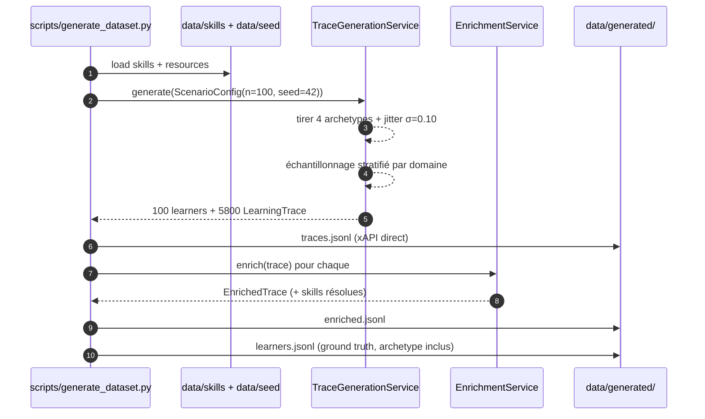
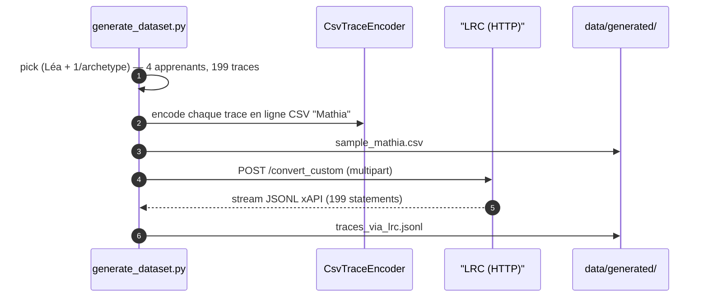
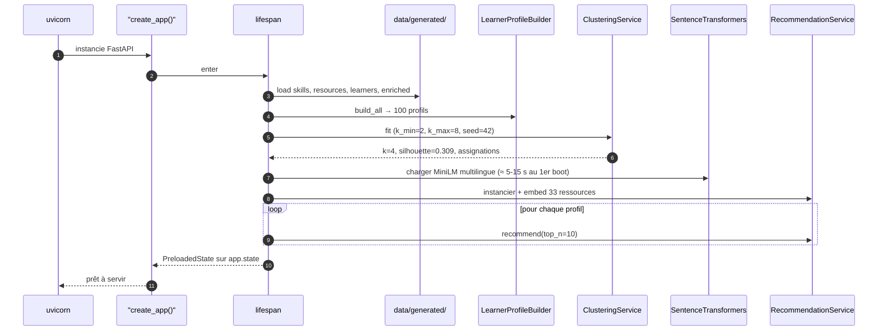
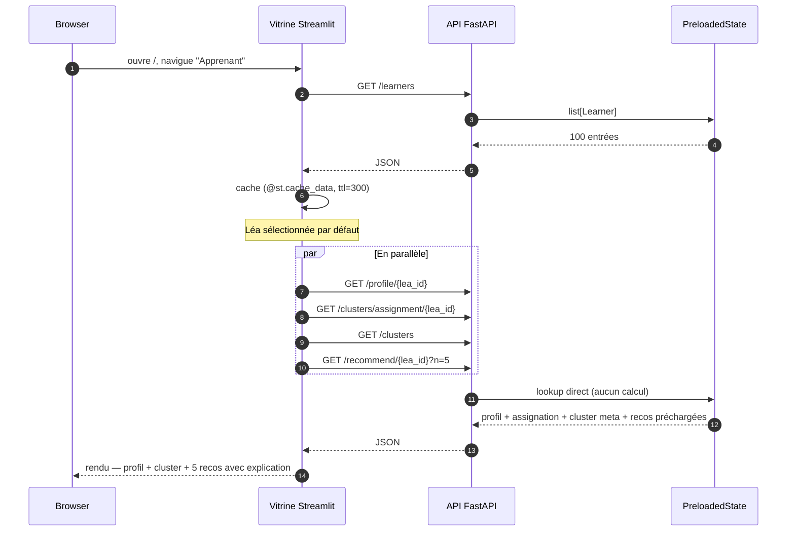

# 05 — Vue runtime

Deux séquences clés : **génération du dataset** (préalable, batch) et **consommation
par la vitrine** (chemin chaud, runtime de l'API).

## Séquence A — Génération du dataset enrichi (batch)

Exécutée via `make dataset` (ou `python scripts/generate_dataset.py`). Reproductible
via la seed unique `42`.

### Variante — via le LRC réel (échantillon)

Si l'opérateur passe `--via-lrc=http://localhost:8080`, le script ajoute :

Voir [How-to — ingest via LRC](../user/how-to/ingest-via-lrc.md) et
[ADR 006](adrs/006-csv-custom-vs-mappers-natifs.md).

## Séquence B — Boot de l'API (lifespan)

Au démarrage de `uvicorn ... --factory`, **avant** que le serveur accepte la première
requête :

Coût total : ~5 s en chaud, **~25 s au tout premier boot** (download du modèle ST).
Les requêtes HTTP ne touchent **jamais** sklearn ni le modèle ST.

## Séquence C — Visualisation pour Léa (chemin chaud)

L'utilisateur sélectionne « Léa Martin » dans la vitrine Streamlit.

Les 4 appels sont parallélisés par le navigateur (HTTP/2 ou pipelining), et chacun est
caché par Streamlit côté front. Temps d'affichage perçu : < 200 ms après le 1er load.
