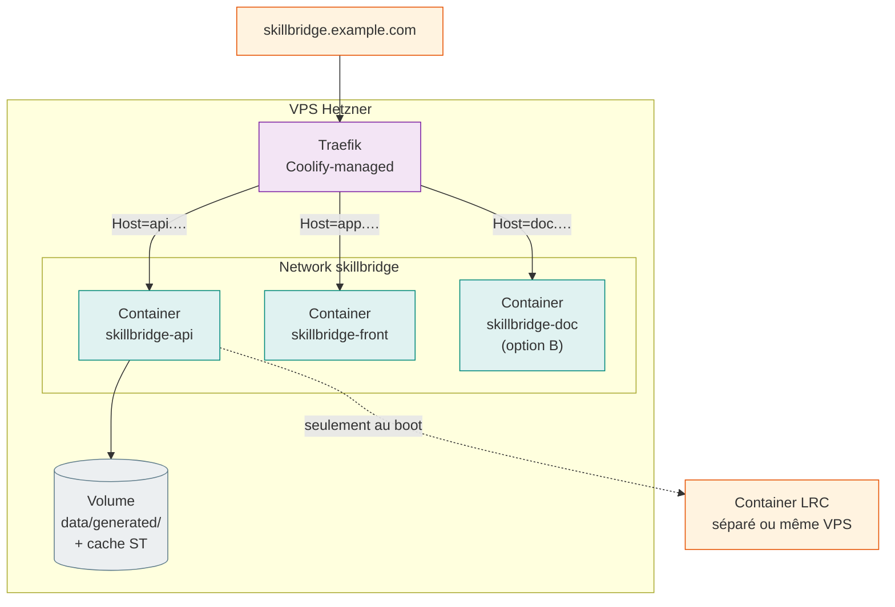

# 07 — Vue de déploiement

!!! success "État d'avancement"
    Le **Lot 5d** (Coolify sur VPS Hetzner) est livré. Trois services sont en ligne :

    - 🎓 Vitrine : [`skillbridge-data.fr`](https://skillbridge-data.fr)
    - 🔌 API : [`api.skillbridge-data.fr`](https://api.skillbridge-data.fr/docs)
    - 📖 Doc (ce site) : [`docs.skillbridge-data.fr`](https://docs.skillbridge-data.fr)

    Le LRC n'est **pas** déployé en ligne (souveraineté + simplification — l'interop
    est démontrée par fixture, cf. [ADR 004](adrs/004-lrc-runbook-vs-submodule.md)). Le
    guide opérationnel pas-à-pas est dans
    [Déployer sur Coolify](../user/how-to/deploy-coolify.md).

## Architecture déployée

| Élément | Choix retenu | Statut |
| --- | --- | --- |
| Plateforme | VPS Hetzner | ✅ provisionnée |
| Orchestration | [Coolify](https://coolify.io/) | ✅ configurée |
| API | Image `skillbridge-api` (Python 3.12 + uvicorn) | ✅ déployée |
| Vitrine | Image `skillbridge-front` (Streamlit headless) | ✅ déployée |
| Doc | Image `skillbridge-docs` (nginx + `site/` MkDocs) | ✅ déployée — **self-hosted** |
| LRC | Service externe, **non déployé** ; fixture committée | ✅ choix assumé |
| Reverse proxy | Traefik (fourni par Coolify) + TLS Let's Encrypt | ✅ auto |

## Note sur l'hébergement de la doc — tranché

Au moment du 5d, deux options étaient ouvertes : GitHub Pages (gratuit, exige un repo
public) ou auto-hébergée sur Hetzner. **Choix retenu : auto-hébergée**, pour cohérence
avec la posture *« déploiement souverain »* du cadrage et pour ne pas conditionner la
publication de la doc à la visibilité du repo. La doc est servie par un nginx Alpine
qui sert le `site/` build par `mkdocs build --strict` (cf. `Dockerfile.docs`).

## Topologie envisagée

## Contraintes respectées

- **Cold start** : le `healthcheck` de l'API a un `start_period: 90s` (mesuré ~60 s en
  container — boot + chargement du modèle ST depuis le cache local + précompute des
  100 × top-10 recos). Le `depends_on: condition: service_healthy` du front attend
  donc bien que l'API soit réellement prête.
- **Modèle ST bundlé au build** dans l'image API (`/opt/hf-cache/`) : aucun téléchargement
  réseau au boot du container, pas de volume persistant nécessaire pour le cache HF.
- **`learners.jsonl`** est servi côté front depuis la fixture
  `data/seed/learners_fixture.jsonl` committée dans le repo (donc disponible dans
  l'image au build). La validation cluster ↔ archétype fonctionne en prod.
- **LRC** : non déployé sur le VPS. L'interop est démontrée par la fixture
  `data/seed/interop_example/` (capture réelle d'une conversion locale) — choix tranché
  dans [ADR 004](adrs/004-lrc-runbook-vs-submodule.md).

## Sécurité

- Aucune donnée personnelle dans le dataset (synthétique via Faker, pseudonymes
  `mbox_sha1sum`).
- Pas d'auth sur l'API : c'est une démo. Si tu veux restreindre l'accès, ajoute une
  **basic auth Traefik** dans Coolify (Labels → Middlewares).
- Le repo a été audité avant publication (scan complet de l'historique : aucun secret,
  aucun email perso, aucun fichier sensible).
