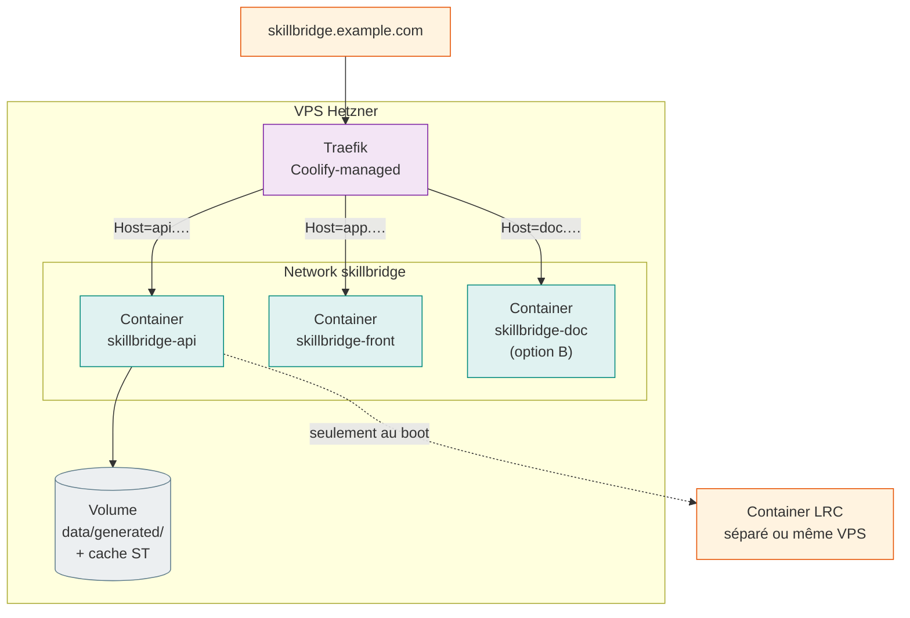

# 07 — Vue de déploiement

!!! warning "État d'avancement"
    Cette section décrit la **cible** de déploiement. Le **Lot 5d** (Coolify / Hetzner)
    n'est pas encore commité. Aujourd'hui, l'app tourne en local via `make demo`.

## Cible

| Élément | Cible | Statut |
| --- | --- | --- |
| Plateforme | VPS Hetzner | À provisionner |
| Orchestration | [Coolify](https://coolify.io/) | À configurer |
| API | Container Python 3.12 + uvicorn | Dockerfile à écrire |
| Vitrine | Container Streamlit headless | Dockerfile à écrire |
| LRC | Container amont déjà packagé (`Prometheus-X-association/learning-records-converter`) | Compose à brancher |
| Reverse proxy | Traefik (fourni par Coolify) + TLS Let's Encrypt | Auto |
| Doc | À trancher au 5d : GitHub Pages ou auto-hébergée (cf. note ci-dessous) | À décider |

## Note sur l'hébergement de la doc

**Piège connu** : GitHub Pages gratuit n'est dispo que sur **repo public**. Le repo
SkillBridge est privé. Au 5d, deux options seront tranchées :

1. **Passer le repo public** quand le niveau 1 est présentable → `mkdocs gh-deploy` OK.
2. **Garder privé** → héberger la doc en container statique sur Hetzner (image Caddy ou
   Nginx servant le `site/` build par `mkdocs build`).

Aucune des deux options ne sera tentée prématurément.

## Topologie envisagée

## Contraintes à respecter

- **Cold start** : l'API précharge ST + 100 recos au lifespan. Sur Coolify, prévoir un
  `healthcheck` avec start-period 60 s + grace period adaptée pour ne pas tuer le
  container avant qu'il soit prêt.
- **Volume persistant** pour le cache ST (`~/.cache/huggingface/`) — sinon le modèle
  serait re-téléchargé à chaque redéploiement.
- **`learners.jsonl`** est consommé localement par la vitrine pour la validation
  cluster ↔ archétype. Il doit être disponible côté Streamlit container (volume partagé,
  ou copie dans l'image au build — décision 5d).
- **LRC** : si déployé sur le même VPS, attention au conflit port 80 (déjà rencontré en
  local, [voir runbook](../lrc_runbook.md)). Traefik résout via les routes `Host=`.

## Sécurité

- Aucune donnée personnelle dans le dataset (synthétique, pseudonymes via `mbox_sha1sum`).
- Pas d'auth sur l'API : c'est une démo. Si exposée, **mettre derrière une auth
  Coolify** ou un basic-auth Traefik.
- Le repo ne contient ni clé, ni secret (audit fait avant chaque push).

Détails opérationnels et runbook complet à produire au 5d.
